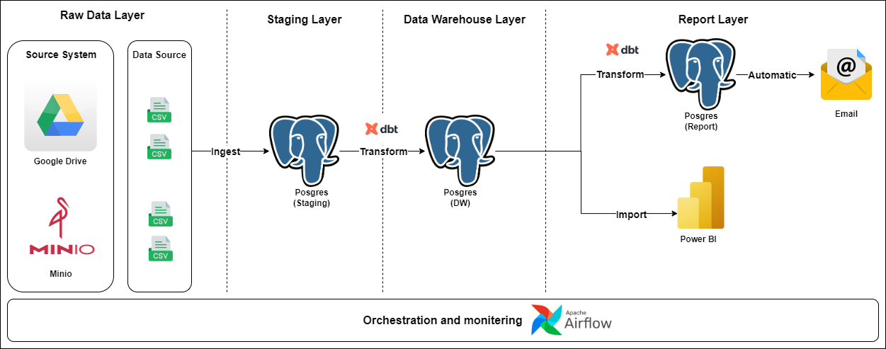
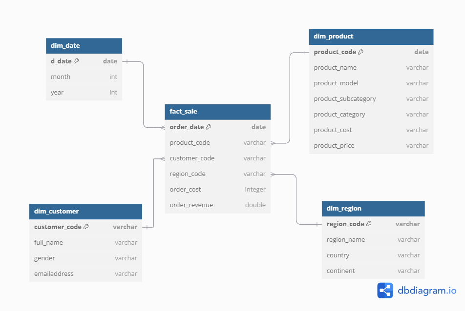

Project Data Warehouse end to end
========

Project Overview
================

- This is an end-to-end data warehouse project. 
- Data is ingested from Minio and Google Drive into a staging layer in PostgreSQL. 
- The data warehouse model is designed, and DBT (Data Build Tool) is used to transform raw data into the data warehouse. 
- An automated email is then sent with an attached Excel file containing a summary of sales data to a specified list of recipients.
- Finally, Power BI is used to build a visualization dashboard.

Dataset
================

- Google Drive: sale2015.csv, sale2016.csv, sale2027.csv, customers.csv, teritory.csv, calendar.csv
- Minio: product.csv, productSubCategory.csv, productCategory.csv

Architecture
================

Data Warehouse Design
================

